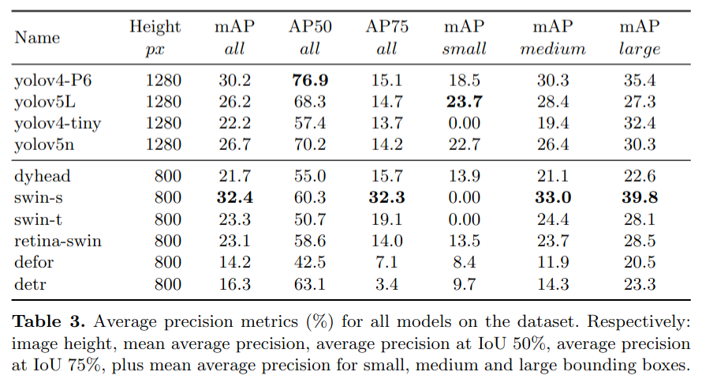
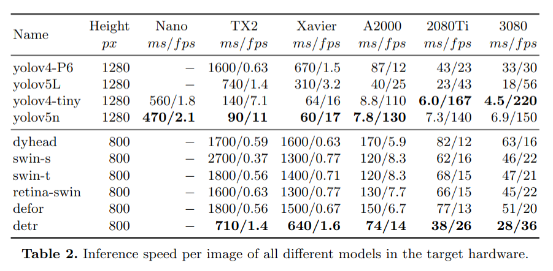
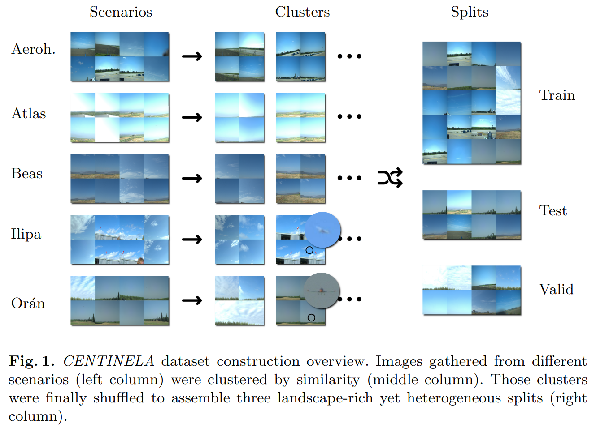

# Iberian Robotics

This repo showcasing the main results of the research paper Benchmark on real-time long-range aircraft detection for safe RPAS operations, plus some additional resources.

## Benchmarking results

## CENTINELA dataset

## Source repositories

- [MMdetection](https://github.com/open-mmlab/mmdetection)
- [Yolov5](https://github.com/ultralytics/yolov5)
- [Yolov4](https://github.com/WongKinYiu/ScaledYOLOv4)
- [Yolov4-tiny](https://github.com/WongKinYiu/PyTorch_YOLOv4)

